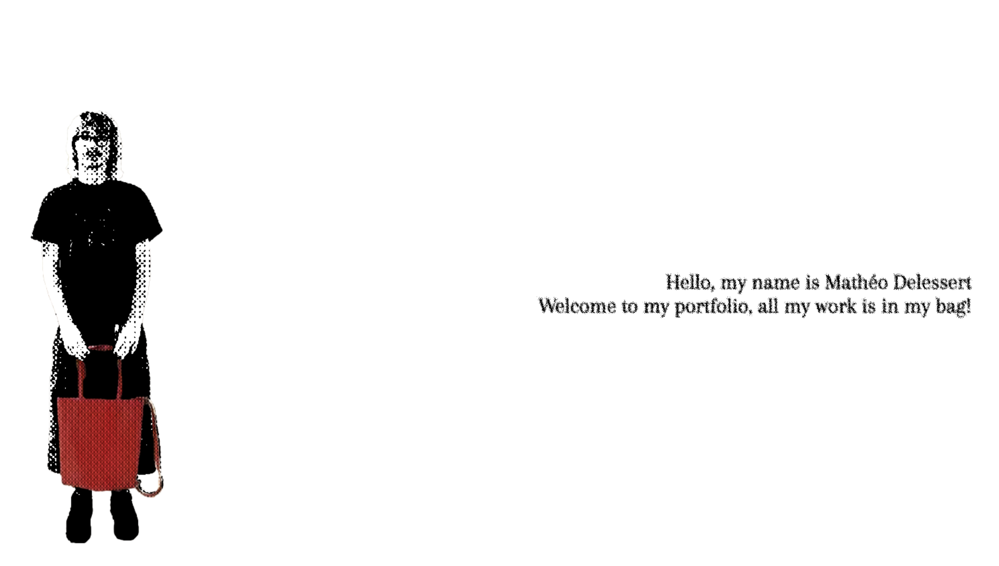

# Mathéo Delessert - Interactive Portfolio

> **Note:** This is a personal project serving as my professional portfolio. I am an **Interactive Media Designer**, and this site is built to showcase my creative work, technical skills, and interactive design approach.

## Overview

This project is an interactive, physics-based web portfolio. Instead of a traditional scrolling grid layout, it features a creative navigation system where all my work is stored inside my bag that you can interact with. It heavily relies on matterJS to create a unique and playful user experience. 

*Note: This experience is designed specifically for desktop devices to ensure optimal performance and interaction. And also cause im a bad devlopper and i have no idea how i will make this shit responsive*   

## The Ecosystem: How Everything Interacts

The architecture is highly modular, splitting concerns like physics configuration, DOM manipulation, animations, and 3D rendering into their own dedicated files. The flow of the application generally follows this lifecycle:

1. **Load Phase (`index.html`):** The DOM loads alongside custom SVG displacement filters for visual styling.
2. **Animation Phase (`animation.js`):** The user is presented with me holding a static bag. Clicking it triggers a sequential image animation that i made using After Effects.
3. **Physics Phase (`physics.js` & `objects.js`):** Once the animation finishes, it hands off to the matterJS physics engine. Objects (representing the different projet i made ) spawn and fall out of the bag.
4. **Interaction Phase (`handlers.js` & `korg.js`):** The user can click on specific objects trigger DOM changes to reveal projects or switch the view context.
5. **3D Rendering (`3d-cd.js`):** Specific projects, like the Korg CD, use threeJS to render a 3D version 

---

## Core Files and Functions Breakdown

### 1. `animation.js` (The Entry Point)
This file handles the initial user interaction.
- **`animate()`**: Listens for a click on the `animation-bag` element and cycles through 15 frame images (`frame1.png` to `frame15.png`).
- **Interaction with Ecosystem**: When it reaches the last frame, it calls `startPhysics()`, effectively transitioning the app from a simple DOM animation to a physics simulation.

### 2. `physics.js` (The Physics Core)
The heart of the `Matter.js` simulation.
- **`initEngine()` & `initRender()`**: Configures the Matter.js engine (gravity) and the renderer (canvas size, wireframes).
- **`startPhysics()`**: The main orchestrator called by `animation.js`. It generates the invisible walls (`createBoundaries`), and progressively adds falling items (`createTabac`, `createFiltre`, etc.) with a slight delay using `setTimeout`. 
- **`setupClickHandlers()`**: Crucial for bridging the Matter.js canvas with user intent. It intercepts standard DOM clicks on the canvas, calculates the exact coordinates scaling, and checks which Matter.js body was clicked.
- **`handleObjectClick(body)`**: Acts as a router. Depending on the `body.label` (e.g., `'aboutme'`, `'korg'`), it forwards the execution to specific logic in `handlers.js` or `korg.js`.

### 3. `objects.js` (The Content Configuration)
Defines the physical and visual properties of every item dropping from the bag.
- **`OBJECT_CONFIG`**: A central dictionary containing spawn coordinates (`spawnX`, `spawnY`), friction, restitution (bounciness), and sprite mapping for every object.
- **`create[Object]()`**: Functions like `createPamplemousse()` instantiate `Matter.Bodies` utilizing the configuration. These are then injected into the world by `physics.js`.

### 4. `boundaries.js` (The Container)
Ensures objects don't fall off the screen.
- **`createBoundaries()`**: Generates invisible static rectangles (ground, ceiling, left wall, right wall).
- **`updateBoundariesOnResize()`**: Keeps the physics container accurate when the user resizes their browser window by recalculating body positions based on `window.innerWidth/Height`.

### 5. `handlers.js` & `korg.js` (The Interactivity)
These handle what happens when an object is clicked.
- **`onAboutMeClick()` / `onPamplemousseCick()`**: Toggle CSS IDs (e.g., changing `aboutme-inactive` to `aboutme`) to trigger overlay displays using pure CSS transitions.
- **`onKorgClick()` (in `korg.js`)**: A complex interaction handler. It modifies the site's entire color theme, hides the hero section, displays the `korg-body`, and actually manipulates the physics world by removing the `ground` and specific objects (making them fall out of view). It provides a `resetAll()` function tied to a "Back" button to restore the initial state and respawn the physics objects.

### 6. `3d-cd.js` (The 3D Renderer)
Handles Three.js initialization and rendering.
- **`initThreeJS()`**: Sets up a `WebGLRenderer`, `PerspectiveCamera`, and a `Scene`. It attaches itself to the `#container-cd` div shown when the Korg project is clicked.
- **`GLTFLoader`**: Asynchronously loads a 3D asset (`assets/model/cd.glb`) and injects it into the scene.
- **Interaction with Ecosystem**: It uses a `ResizeObserver` on its container to ensure the 3D canvas scales correctly when the `korg-body` is dynamically displayed by `korg.js`.

---

## Technologies Used
- **HTML / CSS / JavaScript (Vanilla)**: The core structure, layouts, CSS visual effects (SVG Displacement Filters), and orchestration.
- **Matter.js**: A robust 2D physics engine utilized for rigid body dynamics, collision detection, and user dragging interactions.
- **Three.js**: A cross-browser JavaScript library used to create and display animated 3D computer graphics in a web browser using WebGL.
- **Vite**: The frontend build tool used for a fast, modularized development experience.

## How to Run Locally

1. **Install dependencies**:
   ```bash
   npm install
   ```

2. **Start the development server** (using Vite):
   ```bash
   npx vite
   ```
   *or if configured in your environment:*
   ```bash
   npm run dev
   ```

3. Open the provided `localhost` link in your desktop browser.


Hope you enjoy my portfolio and if have any idea how to improve the UX, the performence *(cause im a bad devlopper as i said before *)  or whatever i will accept gracefully if you open an issues or a pull request :)