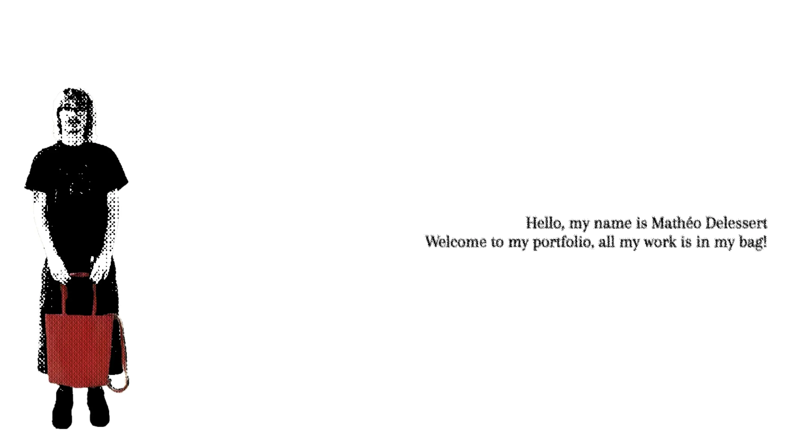

# Mathéo Delessert - Interactive Portfolio 
<a fontsize="40px" src="mathedelessert.ch">matheodelessert.ch</a>

> **Note:** This is a personal project serving as my professional portfolio. I am an **Interactive Media Designer**, and this site is built to showcase my creative work, technical skills, and interactive design approach.

## Overview

This project is an interactive, physics-based web portfolio. Instead of a traditional scrolling grid layout, it features a creative navigation system where all my work is stored inside my bag that you can interact with. It heavily relies on matterJS to create a unique and playful user experience. 

*Note: This experience is designed specifically for desktop devices to ensure optimal performance and interaction. And also cause im a bad devlopper and i have no idea how i will make this shit responsive*   
