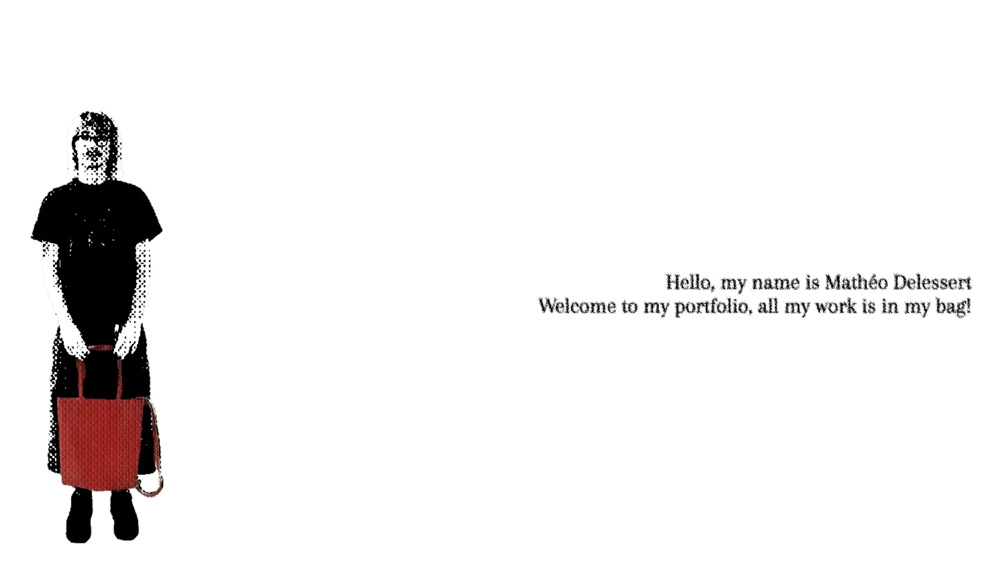

# Mathéo Delessert — Interactive Portfolio

[matheodelessert.ch](https://matheodelessert.ch)

> **Note:** This is a personal project serving as my professional portfolio. I am an **Interactive Media Designer**, and this site is built to showcase my creative work, technical skills, and interactive design approach.

## Overview

This project is an interactive, physics-based web portfolio. Instead of a traditional scrolling grid layout, it features a creative navigation system where all my work is stored inside a bag that you can interact with. It heavily relies on Matter.js to create a unique and playful user experience.

*Note: This experience is designed specifically for desktop devices to ensure optimal performance and interaction. A responsive version of the portfolio will be developed in the future — for now I'm focusing on building the basics.*
